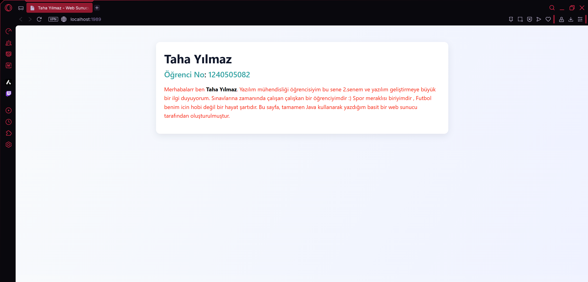

#  Java Web Sunucusu

Bu proje, Java programlama dili kullanılarak geliştirilen 3. parti , kütüphane kullanmayan basit bir web sunucusudur. Tarayıcı üzerinden `http://localhost:1989` adresine gidildiğinde bir HTML sayfası sunar.

---

## 📌 Özellikler

- Sadece **Java** kullanılarak geliştirilmiştir
- **Port 1989** üzerinden bağlantı kabul eder
- HTML, CSS ile biçimlendirilmiş kişisel biyografi sayfası sunar
- **Socket programlama** temellerini öğretir

---

## 👨‍💻 Proje Sahibi

**Ad:** Taha Yılmaz  
**Öğrenci No:** 1240505082  
**Bölüm:** Yazılım Mühendisliği

---

## 🖥️ Ekran Görüntüsü

 

---

## 🚀 Nasıl Çalıştırılır?

### Projeyi Kopyala ve Derleme programına Yapıştır:
```bash
https://github.com/Thyilmaz/Web-Sunucu/blob/main/Kod%20K%C4%B1sm%C4%B1

